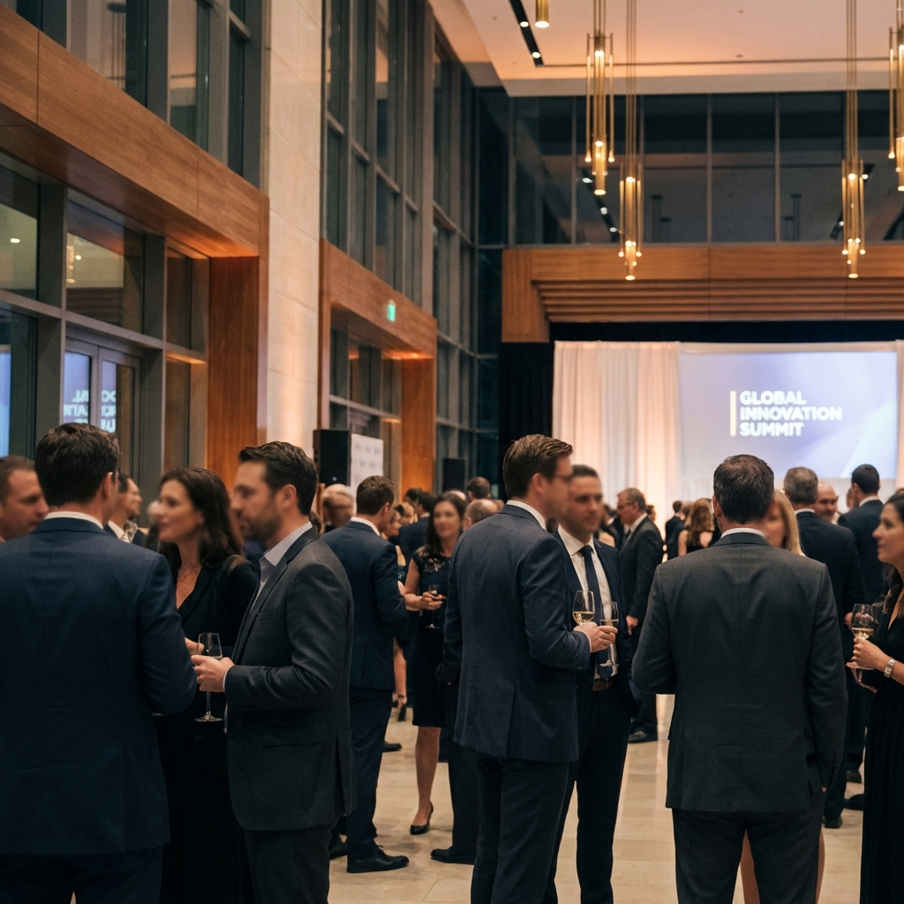
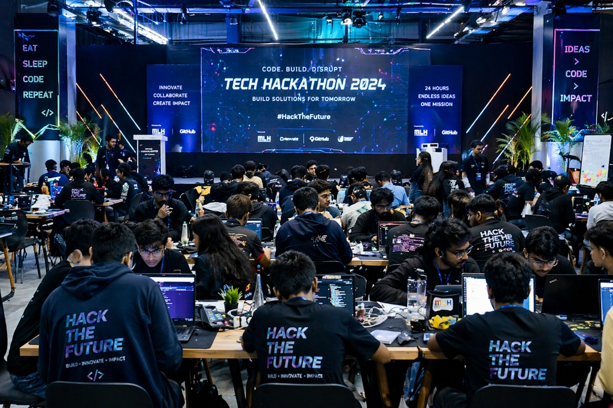

<div align="center">



# 💎 Evox Ventures
### Engineering Unforgettable Experiences

**An elite digital platform transforming the way high-stakes live experiences are architected and managed.**

<br/>

[](https://evox-ventures.vercel.app)
[](https://nextjs.org/)
[](https://reactjs.org/)
[](https://tailwindcss.com/)
[](https://www.framer.com/motion/)

<br/>

[**🚀 View Live Demo**](https://evox-ventures.vercel.app) • [**📂 Documentation**](#-overview) • [**🎯 Project Roadmap**](#-roadmap--future-improvements)

---

</div>

<br/>

## 🌐 Live Demo
The flagship experience is live and deployed with continuous integration:
👉 **[evox-ventures.vercel.app](https://evox-ventures.vercel.app)**

---

## 🌟 Overview
Evox Ventures is a luxury event architecture agency specializing in high-fidelity execution. This repository houses our monolithic full-stack digital experience—featuring immersive web architectures, hardware-accelerated animations, and production-grade performance designed to captivate elite clients.

---

## 🚀 Key Features

- 🎭 **Cinematic Storytelling**: Hardware-accelerated transitions and scroll-driven narratives using Lenis & Framer Motion.
- 💎 **Luxury Design System**: Glassmorphic UI components, dynamic noise textures, and a custom-curated cinematic aesthetic.
- 📸 **Immersive Showcases**: Interactive visual layouts for global corporate events, tech hackathons, and luxury retreats.
- 💰 **Concierge AI & Quote Engine**: A sophisticated multi-step quote generation system for real-time project scoping.
- ⚡ **Production-Grade Performance**: Edge-optimized architecture ensuring sub-second interactions across all devices.
- 📱 **Adaptive Continuity**: Seamless, premium experience across mobile, tablet, and desktop viewports.

---

## 🛠️ Tech Stack

Built with a commitment to engineering excellence and visual depth:

- **Frontend:** [Next.js 15+](https://nextjs.org/) (App Router), [React 19](https://reactjs.org/)
- **Styling:** [Tailwind CSS](https://tailwindcss.com/), Modern CSS Variables
- **Motion:** [Framer Motion](https://www.framer.com/motion/), [Lenis Smooth Scroll](https://lenis.darkroom.engineering/)
- **Backend:** Next.js Server Actions & API Routes
- **Infrastructure:** Vercel (Edge Functions, CI/CD)

---

## 📂 Project Architecture

```text
evox-ventures/
├── client/                 # Next.js Production Core
│   ├── src/
│   │   ├── app/            # App Router: Core Pages & API endpoints
│   │   ├── components/     # Atomic Design System
│   │   │   ├── home/       # Modular Landing Sections
│   │   │   ├── layout/     # Master Layout Structures
│   │   │   ├── portfolio/  # Case Study Architectures
│   │   │   └── ui/         # Premium UI Components (Particles, Reveals)
│   │   └── lib/            # Shared Logic & Providers
│   └── public/             # High-Fidelity Assets & Cinematography
```

---

## 📸 Preview Section

<div align="center">
  
  
</div>

---

## ⚡ Deployment & CI/CD
The project is architected for **Continuous Deployment** on Vercel. Every push to the `main` branch undergoes an automated production build and health check before going live.

- **Platform:** [Vercel](https://vercel.com)
- **Environment:** Production (Edge)
- **Continuous Integration:** GitHub Actions / Vercel Hooks

---

---

## 🛡️ License
Distributed under the MIT License. See `LICENSE` for more information.

---

<div align="center">
  <strong>Architected & Maintained by <br/><a href="https://github.com/singhankit001">Ankit Singh</a></strong><br/>
  High-Performance Software Engineer
</div>
